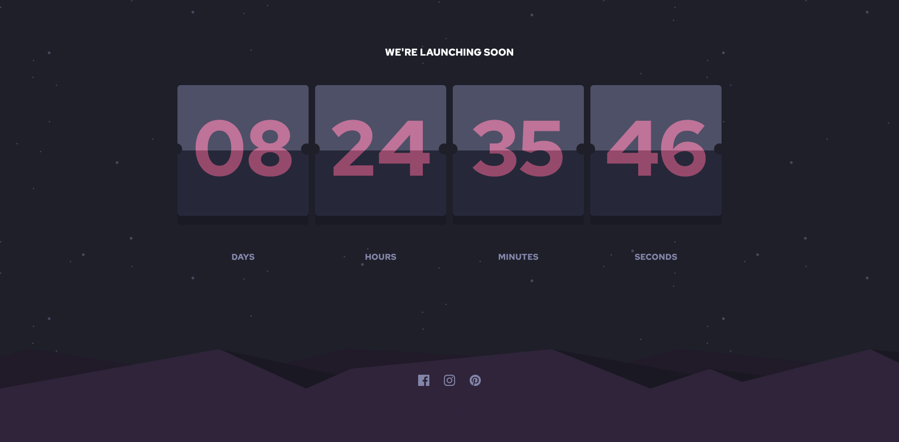
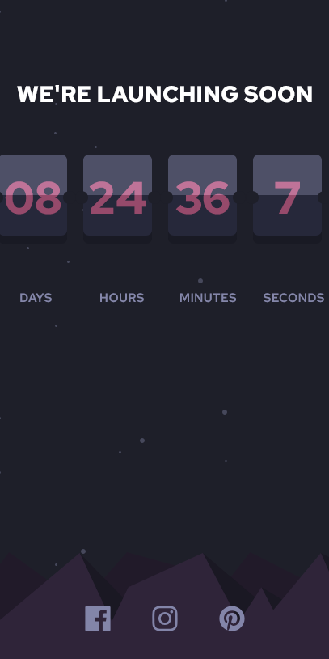

# Frontend Mentor - Launch countdown timer solution

This is a solution to the [Launch countdown timer challenge on Frontend Mentor](https://www.frontendmentor.io/challenges/launch-countdown-timer-N0XkGfyz-). Frontend Mentor challenges help you improve your coding skills by building realistic projects. 

## Table of contents

- [Overview](#overview)
  - [The challenge](#the-challenge)
  - [Screenshot](#screenshot)
  - [Links](#links)
- [My process](#my-process)
  - [Built with](#built-with)
  - [What I learned](#what-i-learned)
  - [Continued development](#continued-development)
  - [Useful resources](#useful-resources)
- [Author](#author)

## Overview

### The challenge

Users should be able to:

- See hover states for all interactive elements on the page
- See a live countdown timer that ticks down every second (start the count at 14 days)
- **Bonus**: When a number changes, make the card flip from the middle

### Screenshot

### Links

- Solution URL: [Github repo](https://github.com/Tonilocke/parcel-react-countdown-timer)
- Live Site URL: [Netlify](https://parcel-react-countdown-timer.netlify.app/)

## My process

### Built with

- Semantic HTML5 markup
- CSS custom properties
- CSS Grid
- Mobile-first workflow
- [React](https://reactjs.org/) - JS library
- [Parcel](https://parceljs.org/) -JS build tool

### What I learned

I did a messy code, so i don't think i learned a lot! xD

### Continued development
I have used Parcel and React, and i plan to keep using them on my next projects!

### Useful resources

- [MDN](https://developer.mozilla.org/en-US/) - Must use for web dev!
- [React](https://reactjs.org/) - Great Docs, full of examples. A must if you use react.
- [Parcel](https://parceljs.org/) - Parcel Docs, really great. Will definetly use it again for my next project!

## Author

 Website - (building...) - [tonidev.eu](building...)
- Frontend Mentor - [@Tonilocke](https://www.frontendmentor.io/profile/Tonilocke)
- Twitter - [@toni_tonidev](https://x.com/toni_tonidev)

